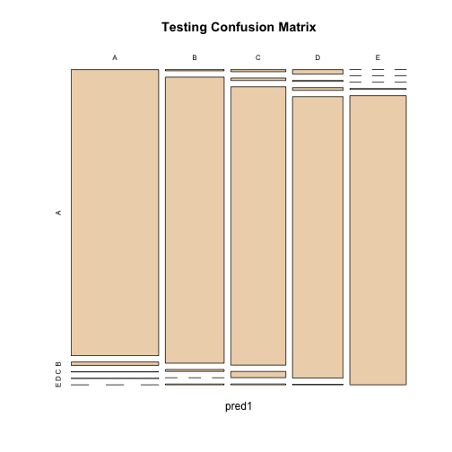
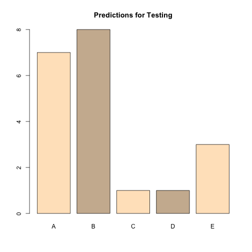
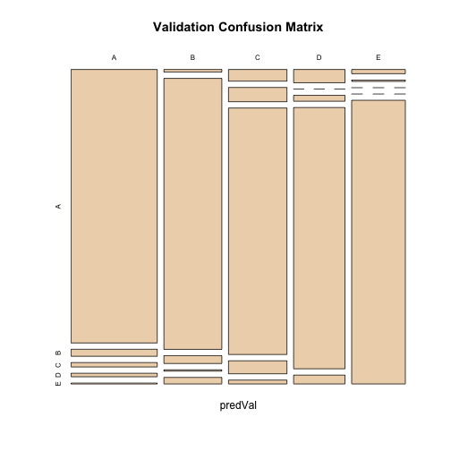
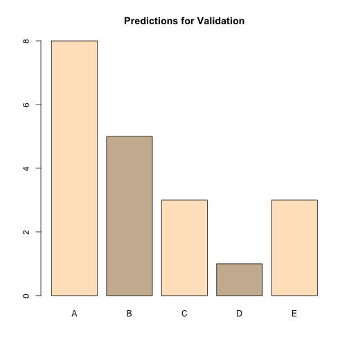

**Introduction**

In the present work estimates of quality of of weigth lifting excerises is performed. The analysis takes as a base the study documented in the article Qualitative Activity Recognition of **Weight Lifting Exercises** of Eduardo Velloso and others authors. This kind of study is part of the so called Human Activity Recognition (HAR).

Document is divided in three stages: first part, exploratory analysis deals with incomplete data, where those variables wich meany NA's are not considered, second part performs an random forest model to variables selected; third part performs cross validation and prediction for supplied 20 testing cases. 

In order to optimize time proccess, model analysis is run with about 15% random sample of training set. After verify program is running the model is applied with wole data for 19,621 cases documented.


**Exploratory analysis**

Explloratori analysis was used to identify thos variables numeric and with no NA. Summary of variables was generated. This is just a little sample of statistics for variables selected.


```
##      Min. 1st Qu. Median     Mean 3rd Qu.  Max.
## s1  -28.9    1.10 113.00  64.4100   123.0 162.0
## s2  -55.8    1.76   5.28   0.3053    14.9  60.3
## s3 -180.0  -88.30 -13.00 -11.2100    12.9 179.0
```

```
## $roll_belt
##    Min. 1st Qu.  Median    Mean 3rd Qu.    Max. 
##  -28.90    1.10  113.00   64.41  123.00  162.00 
## 
## $pitch_belt
##     Min.  1st Qu.   Median     Mean  3rd Qu.     Max. 
## -55.8000   1.7600   5.2800   0.3053  14.9000  60.3000
```

Part of exploratory was done un first stage of Random Forest Model application. This consists in analyse about 15% of total population to test code an performance of the model. 

**Random Forest Model**

After exploring data, numerical variables which cover three main aspects of numerical variables are considered. Belt, Arm and Dumbbell sensors included 24 variables associated to gyroscope, acceleration, roll, pitch and yaw features.

Cariables used are: roll_belt, pitch_belt, yaw_belt, gyros_arm_x, gyros_arm_y, gyros_arm_z, gyros_belt_x, gyros_belt_y, gyros_belt_z, accel_belt_x, accel_belt_y, accel_belt_z, roll_arm, pitch_arm, yaw_arm, accel_arm_x, accel_arm_y, accel_arm_z, roll_dumbbell, pitch_dumbbell, yaw_dumbbell, magnet_arm_x, magnet_arm_y, magnet_arm_z.

Given we have a large sample, is divaded in three population subsets: one of 60% of size, second of 20% and third of 20%. First one is assigned as training, second one as testing and third one for VALIDATION.

Once subsets are defined, the validation set is divided in to subsets: training validation of 70% and testing validation of 30%.


```
## Loading required package: lattice
## Loading required package: ggplot2
## Loading required package: randomForest
## randomForest 4.6-10
## Type rfNews() to see new features/changes/bug fixes.
## Loading required namespace: e1071
```

```
## Random Forest 
## 
## 11776 samples
##    24 predictor
##     5 classes: 'A', 'B', 'C', 'D', 'E' 
## 
## No pre-processing
## Resampling: Bootstrapped (25 reps) 
## 
## Summary of sample sizes: 11776, 11776, 11776, 11776, 11776, 11776, ... 
## 
## Resampling results across tuning parameters:
## 
##   mtry  Accuracy   Kappa      Accuracy SD  Kappa SD   
##    2    0.9681533  0.9597426  0.003935774  0.004990457
##   13    0.9676323  0.9590853  0.003498526  0.004433086
##   24    0.9580743  0.9470097  0.005626254  0.007122384
## 
## Accuracy was used to select the optimal model using  the largest value.
## The final value used for the model was mtry = 2.
```

```
## Confusion Matrix and Statistics
## 
##      
## pred1    A    B    C    D    E
##     A 1098   13    1    1    0
##     B    3  738    5    0    2
##     C    5    6  672   15    2
##     D   10    2    6  625    1
##     E    0    0    0    2  716
## 
## Overall Statistics
##                                           
##                Accuracy : 0.9811          
##                  95% CI : (0.9764, 0.9852)
##     No Information Rate : 0.2845          
##     P-Value [Acc > NIR] : < 2.2e-16       
##                                           
##                   Kappa : 0.9761          
##  Mcnemar's Test P-Value : NA              
## 
## Statistics by Class:
## 
##                      Class: A Class: B Class: C Class: D Class: E
## Sensitivity            0.9839   0.9723   0.9825   0.9720   0.9931
## Specificity            0.9947   0.9968   0.9914   0.9942   0.9994
## Pos Pred Value         0.9865   0.9866   0.9600   0.9705   0.9972
## Neg Pred Value         0.9936   0.9934   0.9963   0.9945   0.9984
## Prevalence             0.2845   0.1935   0.1744   0.1639   0.1838
## Detection Rate         0.2799   0.1881   0.1713   0.1593   0.1825
## Detection Prevalence   0.2837   0.1907   0.1784   0.1642   0.1830
## Balanced Accuracy      0.9893   0.9846   0.9869   0.9831   0.9962
```

 

```
## A B C D E 
## 7 8 1 1 3
```

 

```
##  [1] B A B A A E D B A A B C B A E E A B B B
## Levels: A B C D E
```

```
## Random Forest 
## 
## 2749 samples
##   24 predictor
##    5 classes: 'A', 'B', 'C', 'D', 'E' 
## 
## No pre-processing
## Resampling: Bootstrapped (25 reps) 
## 
## Summary of sample sizes: 2749, 2749, 2749, 2749, 2749, 2749, ... 
## 
## Resampling results across tuning parameters:
## 
##   mtry  Accuracy   Kappa      Accuracy SD  Kappa SD  
##    2    0.9053481  0.8801513  0.009077956  0.01151582
##   13    0.9041215  0.8785473  0.009098604  0.01159907
##   24    0.8921445  0.8633360  0.010910547  0.01398121
## 
## Accuracy was used to select the optimal model using  the largest value.
## The final value used for the model was mtry = 2.
```

```
## Confusion Matrix and Statistics
## 
##        
## predVal   A   B   C   D   E
##       A 311   8   5   4   1
##       B   2 207   6   1   5
##       C   9  11 190  10   3
##       D   9   0   4 177   6
##       E   3   1   0   0 201
## 
## Overall Statistics
##                                           
##                Accuracy : 0.925           
##                  95% CI : (0.9085, 0.9395)
##     No Information Rate : 0.2845          
##     P-Value [Acc > NIR] : < 2.2e-16       
##                                           
##                   Kappa : 0.9053          
##  Mcnemar's Test P-Value : 0.006666        
## 
## Statistics by Class:
## 
##                      Class: A Class: B Class: C Class: D Class: E
## Sensitivity            0.9311   0.9119   0.9268   0.9219   0.9306
## Specificity            0.9786   0.9852   0.9659   0.9807   0.9958
## Pos Pred Value         0.9453   0.9367   0.8520   0.9031   0.9805
## Neg Pred Value         0.9728   0.9790   0.9842   0.9847   0.9845
## Prevalence             0.2845   0.1934   0.1746   0.1635   0.1840
## Detection Rate         0.2649   0.1763   0.1618   0.1508   0.1712
## Detection Prevalence   0.2802   0.1882   0.1899   0.1670   0.1746
## Balanced Accuracy      0.9549   0.9486   0.9464   0.9513   0.9632
```

 

```
## A B C D E 
## 8 5 3 1 3
```

 


**Analysis of results**

Time consumed for precessing Random Forest model for 19,621 cases was 3hours 40min aprox.

Plots for empirical distribution of prediction for testing and validate sets are given. To show graphically the accuracy of estimation, plots of confusion matrix for testing and validate sets are added. 

Accuracy on testing set is 0.94 compared with 0.98 of validating set. The difference is reasonable since validating size is a third part of training part. Confidence inerval for testing prediction is (0.9741, 0.9833) and (0.9215, 0.9502) for validating.

Balanced accuracy for different factors range from 0.97 to 0.99 for testing set and from 0.95 to 0.97 for valiating set. Kappa value is 0.92 for validating set while for testng set is 0.97. These results are consistent with accuracy for both sets


**Conclusions**

With samples of 60% for trining, 20% for testing and 20% for validating, compared predictions of testing and validating are consistent. There is an equlibrium for sensitvity and specifity precision rounding 0.96 for validating and 0.99 for testing.

Because the amount of data computing time consumed was hight, but as a result high level prediction was achieved for predictions in testing and validating test. Standard errors for accuracy where small for both prediction sets. The predicions for validating set were as expected based on results obtained in training-testing set.
